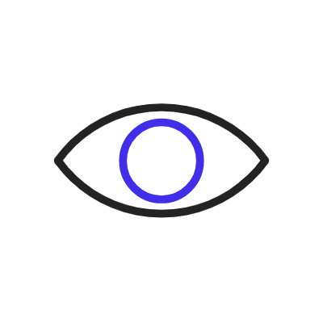

  

- 🌱 I’m currently a Computer Science student at Graphic Era Deemed to be University, Dehradun.  

<h1 align="center"> Connect with me: </h1> 

<h1 align="center"> Tech Stack: </h1>

              

<h1 align="center"> GitHub Stats: </h1>

 

<h1 align="center"> </h1>

<h1 align="center"> 
  Visitor count 
  
</h1>